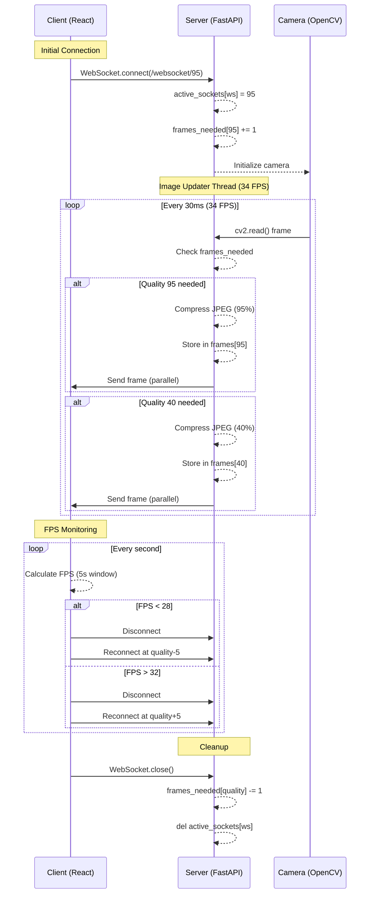

# Live Streaming Application Documentation

## Overview
This application provides adaptive live video streaming from a webcam to a React frontend with quality adjustment based on network conditions. The system consists of:

1. **Frontend**: React/Vite application with WebSocket connection
2. **Backend**: FastAPI server with OpenCV camera capture
3. **Adaptive Streaming**: Automatic quality adjustment based on FPS

## How to Run

<details>
<summary>Step-by-step setup instructions (Click to Expand)</summary>

### Prerequisites
- Python 3.7+
- Node.js 18+ or Bun
- Webcam connected to your machine

### Backend Setup
```bash
# Clone repository
git clone git@github.com:Anga205/ReRo-CCTV.git
cd ReRo-CCTV/backend-fastapi

# Create virtual environment
python3 -m venv venv
source venv/bin/activate  # Linux/Mac
venv\Scripts\activate     # Windows

# Install dependencies
pip install -r requirements.txt

# Run server (default port 6732)
uvicorn main:app --port 6732 --host 0.0.0.0
```

### Frontend Setup

```bash
cd ReRo-CCTV/frontend-vite

# Install dependencies
bun install  # or npm install

# Start development server
bun run dev      # or npm run dev
```

### Environment Variables

Create `.env` file in frontend directory:
```bash
# For production use:
VITE_BACKEND_URL=https://backend.url.here
# (This defaults to localhost:6732 if u dont set it)
```

### Accessing the Application

- **Frontend**: `http://localhost:5173`

- **Backend**: `ws://localhost:6732/websocket/{quality}`
</details>

## How it works
<details>
<summary>System architecture and workflow (Click to Expand)</summary>



### Key Components

**Camera Capture Thread**
- Runs at 34 FPS using precise timing
- Captures frames from webcam (camera index 0)
- Processes only required quality levels

**WebSocket Management**
- Handles client connections
- Tracks active connections and their quality requirements
- Automatically cleans up disconnected clients

**Adaptive Quality Algorithm**
- Frontend monitors frames received in 5s window
- Quality decreases when FPS < 28
- Quality increases when FPS > 32
- Maintains stable FPS between 28-32

</details>

## Code Explanation
<details>
<summary>Frontend (React/Vite)</summary>

### `LiveStream.tsx` Component
```ts
// WebSocket connection management
const connectWebSocket = (quality: number) => {
  // Creates new WebSocket connection with specified quality
  // Handles frame reception and FPS calculation
};

// FPS calculation
const updateFps = () => {
  // Filters frame timestamps to last 5 seconds
  // Calculates FPS as (frame count)/5
};

// Quality adjustment
const adjustQuality = () => {
  // Decreases quality if FPS < 28
  // Increases quality if FPS > 32
  // Changes in 5% increments
};

// Rendering
return (
  <div>
    <div className="stats"> {/* Status display */} </div>
     {/* Video display */}
  </div>
);
```

**Key Features**
- **Dynamic Quality Adjustment:** Automatically optimizes stream quality
- **Efficient Blob Handling:** Uses `URL.createObjectURL()` for fast image rendering
- **Memory Management:** Revokes previous image URLs to prevent leaks
- **Connection Resilience:** Automatic reconnection on quality change
- **Real-time Stats:** Displays quality, FPS, and connection status

</details>

<details>
<summary>Backend (FastAPI/Python)</summary>

```python
# Global state management
active_sockets: dict[WebSocket, int] = {}  # WebSocket -> quality
frames_needed = Counter()  # Quality -> client count
frames: dict[int, bytes] = {}  # Quality -> JPEG data
lock = threading.Lock()  # Thread synchronization

# Camera thread
def image_updater():
    while True:
        # Capture frame from camera
        # Process required qualities
        # Maintain precise 34 FPS timing

# WebSocket endpoint
@app.websocket("/websocket/{quality}")
async def websocket_endpoint(websocket, quality):
    # Validate quality (30-95)
    # Register client
    # Maintain connection until closed

# Frame distribution
def update_websockets_for_quality(quality):
    # Send frame to all clients requiring this quality
    # Remove disconnected clients
```
**Key Features**

- **Precise Frame Timing:** Maintains 34 FPS using `time.perf_counter()`
- **Efficient Encoding:** Only compresses needed quality levels
- **Thread-safe Operations:** Uses locking for shared resources
- **Parallel Distribution:** Sends frames in separate threads
- **Automatic Cleanup:** Removes disconnected clients
- **Resource Management:** Properly releases camera on shutdown
</details>